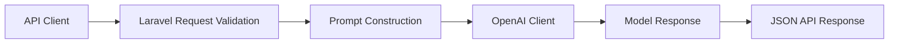

# Predictive Analytics Module

> A Laravel API experiment that accepts five customer signals and returns model-generated text in a stable JSON envelope.

Predictive Analytics Module is a Laravel API experiment for teams exploring how a clean application boundary can connect validated customer data to an external language-model service. A request enters through a small JSON contract, is checked at the controller boundary, transformed into a provider prompt, and returned as model-generated text in a stable JSON envelope that a frontend or downstream workflow can consume.

## What the module delivers

| Capability | Implementation evidence |
|---|---|
| Stable request contract | `routes/api.php` exposes `POST /api/predict-churn` with five numeric inputs: age, activity, payment history, and two extensible feature fields. |
| Explicit validation and prompt construction | `app/Http/Controllers/PredictiveAnalyticsController.php` validates the payload, builds the provider prompt, and owns the response mapping. |
| Provider integration seam | `openai-php/client` is called behind the controller boundary, leaving a clear seam for a deterministic model or another provider later. |
| Offline contract evidence | `tests/Feature/PredictiveAnalyticsEndpointTest.php` mocks the provider boundary and checks inputs, request options, and JSON output without live credentials. |

That combination makes the repository useful as a compact reference for API integration, validation, provider isolation, and an incremental path toward a real data-science pipeline.

## Architecture



## Code map and evidence

| Concern | Location | What is actually implemented |
|---|---|---|
| HTTP contract | `routes/api.php` | `POST /api/predict-churn` plus the default Sanctum example route |
| Validation, prompt and provider call | `app/Http/Controllers/PredictiveAnalyticsController.php` | Five numeric fields are validated, interpolated into a prompt, sent to the OpenAI PHP client, and returned as JSON |
| Runtime contract | `.env.example` and `env('OPENAI_API_KEY')` | The controller reads the API key directly from the environment |
| Tests | `tests/Feature/ExampleTest.php`, `tests/Unit/ExampleTest.php`, `tests/Feature/PredictiveAnalyticsEndpointTest.php` | Laravel smoke coverage plus an offline happy-path provider-contract test for prompt construction, request options and JSON response; it does not assert invalid-payload handling or make a live provider call |

The current controller uses the OpenAI Completions API with the `gpt-3.5-turbo` model name. The provider-contract test verifies the local validation, prompt and response shape without credentials; compatibility with a current live provider endpoint remains unverified, so treat the external call as an experiment to verify before extending it.

Run the provider-independent contract check with:

```bash
php artisan test --filter=PredictiveAnalyticsEndpointTest
```

## Example Workflow

Request:

```http
POST /api/predict-churn
Content-Type: application/json
```

```json
{
  "age": 30,
  "avg_monthly_activity": 15,
  "payment_history_score": 9.2,
  "feature_4": 12.3,
  "feature_5": 7.8
}
```

The controller validates each value, builds a churn-analysis prompt, sends it to the configured external model and returns the model-generated text in a stable JSON envelope.

## Tech Stack

| Area | Technology |
|---|---|
| Language | PHP 8.2+ |
| Backend | Laravel 11 |
| API | Laravel routing/controllers |
| Data | Laravel database layer; SQLite supported by the default application setup |
| AI | `openai-php/client` |
| Testing | PHPUnit 11 |

## Engineering Highlights

### Explicit API validation
The endpoint does not pass arbitrary request payloads directly to the model. Expected features are defined as numeric inputs at the Laravel validation boundary.

### Clear separation between API and inference service
The Laravel application provides the HTTP/application layer while the model client provides the external inference mechanism, leaving a natural seam for replacing prompt inference with a deterministic statistical model later.

### Honest model boundary
The controller currently trims the provider's text into a `churn_probability` JSON field; it does not parse or calibrate that text as a probability. A language model producing a percentage is not equivalent to a calibrated churn model.

## Getting Started

### Requirements

- PHP 8.2+
- Composer
- Node/npm for the default Laravel frontend tooling
- OpenAI API credentials for the current inference implementation

```bash
composer install
cp .env.example .env
php artisan key:generate
php artisan migrate
php artisan serve
```

Configure the OpenAI credential in the environment before using the churn endpoint.

For example, add `OPENAI_API_KEY=...` to `.env`. Do not commit the value.

## Repository Structure

```text
app/Http/Controllers/   API controller and request flow
config/                 Laravel application configuration
database/               Migrations, factories and seeders
routes/                 HTTP/API routes
tests/                  Laravel test suites
```

## Status

**Experimental.** The API integration exists, but the repository should not be represented as a validated predictive-analytics or scientific modelling system until a real modelling/evaluation pipeline is implemented.

## Next engineering steps

To evolve beyond the current prompt-based endpoint, add:

1. versioned CSV/JSON dataset ingestion;
2. reproducible preprocessing and missing-data handling;
3. deterministic baseline models;
4. train/validation/test separation;
5. calibration and metrics such as ROC-AUC, precision/recall and Brier score;
6. saved experiment metadata and model versioning;
7. visual evaluation reports.

These additions would establish a reproducible modelling and evaluation path.

## License

The Composer project metadata declares MIT. No standalone `LICENSE` file is currently present, so redistribution terms should be verified and a license file added before treating the repository as a distributable project.

---

**Jason Lee**  
GitHub: [@Masterleeaus](https://github.com/Masterleeaus)
