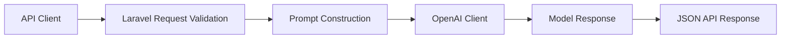

# Churn Risk Assessment API

**An experimental Laravel API for exploring structured churn-risk assessment through an external language-model service.**

## Overview

This repository is a small Laravel 11 experiment around accepting structured customer attributes, validating them at an API boundary and asking an external model for a churn assessment.

It is important to be precise about what the code currently proves: **this is not a trained statistical forecasting or machine-learning pipeline**. There is no fitted predictive model, feature engineering pipeline, benchmark dataset or quantitative evaluation implementation in the current repository. The existing controller performs prompt-based inference through an OpenAI client.

That makes the project useful as evidence of API integration and as a starting point for data/AI experimentation, but not yet strong evidence of scientific predictive modelling.

## Current Capabilities

- Laravel 11 application structure.
- REST endpoint for churn-assessment requests.
- Server-side validation of five numeric input features.
- OpenAI PHP client integration.
- JSON API response contract.
- Laravel database, queue, cache and authentication infrastructure available for extension.
- PHPUnit/Laravel test tooling included by the application skeleton.

## Architecture



## Example Workflow

Request:

```http
POST /api/predict-churn
Content-Type: application/json
```

```json
{
  "age": 30,
  "avg_monthly_activity": 15,
  "payment_history_score": 9.2,
  "feature_4": 12.3,
  "feature_5": 7.8
}
```

The controller validates each value, builds a churn-analysis prompt, sends it to the configured external model and returns the generated assessment in JSON.

## Tech Stack

| Area | Technology |
|---|---|
| Language | PHP 8.2+ |
| Backend | Laravel 11 |
| API | Laravel routing/controllers |
| Data | Laravel database layer; SQLite supported by the default application setup |
| AI | `openai-php/client` |
| Testing | PHPUnit 11 |

## Engineering Highlights

### Explicit API validation
The endpoint does not pass arbitrary request payloads directly to the model. Expected features are defined as numeric inputs at the Laravel validation boundary.

### Clear separation between API and inference service
The Laravel application provides the HTTP/application layer while the model client provides the external inference mechanism, leaving a natural seam for replacing prompt inference with a deterministic statistical model later.

### Honest model boundary
A language model producing a percentage is not equivalent to a calibrated churn model. For scientific or analytics use, the next meaningful engineering step is to introduce a real dataset, reproducible preprocessing, train/evaluation splits, baseline models and quantitative metrics.

## Getting Started

### Requirements

- PHP 8.2+
- Composer
- Node/npm for the default Laravel frontend tooling
- OpenAI API credentials for the current inference implementation

```bash
composer install
cp .env.example .env
php artisan key:generate
php artisan migrate
php artisan serve
```

Configure the OpenAI credential in the environment before using the churn endpoint.

## Repository Structure

```text
app/Http/Controllers/   API controller and request flow
config/                 Laravel application configuration
database/               Migrations, factories and seeders
routes/                 HTTP/API routes
tests/                  Laravel test suites
```

## Status

**Experimental.** The API integration exists, but the repository should not be represented as a validated predictive-analytics or scientific modelling system until a real modelling/evaluation pipeline is implemented.

## Recommended Scientific/Data Roadmap

The highest-value next iteration would add:

1. versioned CSV/JSON dataset ingestion;
2. reproducible preprocessing and missing-data handling;
3. deterministic baseline models;
4. train/validation/test separation;
5. calibration and metrics such as ROC-AUC, precision/recall and Brier score;
6. saved experiment metadata and model versioning;
7. visual evaluation reports.

Those additions would turn the repository from an AI API experiment into credible data-science evidence.

## License

The Composer project metadata declares MIT. No standalone `LICENSE` file is currently present, so redistribution terms should be verified and a license file added before treating the repository as a distributable project.

---

**Jason Lee**  
GitHub: [@Masterleeaus](https://github.com/Masterleeaus)
