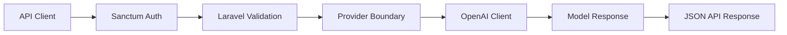

# Predictive Analytics Module

> A Laravel API experiment that accepts five customer signals and returns model-generated text in a stable JSON envelope.

## Overview

Predictive Analytics Module is a compact Laravel application for exploring the seam between an authenticated API, validated customer-like signals, and an external language-model provider. A request passes through Sanctum authentication and bounded input validation, is converted into a provider prompt, and returns model-generated text in a stable JSON envelope for a frontend or downstream workflow.


## Measured evidence

This repository does **not** claim a validated churn model. Its reproducible evidence is the API and provider boundary around an experimental model call.

The focused feature suite contains **11 test methods**, with the authentication-content-negotiation case expanded across three Accept-header variants.

| Tested boundary | Evidence |
| --- | --- |
| Mocked provider happy path | validated inputs reach the provider seam and return the expected JSON envelope |
| Unauthenticated access | rejected before provider invocation |
| Bearer-token lifecycle | accepted while valid and rejected after token revocation |
| Per-user throttling | independent user buckets and stable limits across IP changes |
| Malformed/extreme numeric input | rejected before provider invocation |
| Missing provider key | returns a controlled 503 instead of attempting an external call |
| JSON auth failures | remain API-shaped even without a JSON Accept header |

Reproduce the credential-free lane with:

```bash
php artisan test --filter=PredictiveAnalyticsEndpointTest
```

The CI workflow runs this same focused suite against SQLite with a placeholder test key. It does **not** make a live provider call or establish predictive accuracy.

## What is new

The useful engineering contribution here is **boundary-first model integration**, not prediction quality.

```text
Authenticated request
      ↓
Bounded validation
      ↓
Provider configuration check
      ↓
External model seam
      ↓
Stable API envelope
```

Rejected requests stop before the provider boundary, making authentication, abuse controls, validation and provider configuration independently testable.

### Evidence status

- **Implemented and tested:** authenticated API contract, throttling, validation, provider isolation and failure behavior.
- **Experimental:** provider-generated churn text.
- **Not evaluated:** calibration, predictive accuracy, ranking quality or generalisation.
- **Not claimed:** a trained churn model, production predictive analytics, tenant isolation or decision-grade probability estimates.

## Verified capabilities

| Capability | Implementation evidence |
|---|---|
| Stable request contract | `routes/api.php` exposes authenticated `POST /api/v1/predict-churn` with five numeric inputs: age, activity, payment history, and two extensible feature fields. |
| Authenticated application boundary | `auth:sanctum` rejects unauthenticated requests before the controller or provider boundary is reached; the endpoint also uses Laravel's built-in `throttle:10,1` guard. |
| Explicit validation and abuse boundary | `app/Http/Controllers/PredictiveAnalyticsController.php` rejects malformed, non-finite, exponent-form, oversized, negative, and out-of-range values before provider invocation. |
| Isolated provider seam | `app/Services/ChurnPredictionProvider.php` owns prompt construction and the OpenAI client call; a missing key disables the external call with a 503 response. |
| Credential-free contract evidence | `tests/Feature/PredictiveAnalyticsEndpointTest.php` covers the mocked happy path, real SQLite-backed bearer-token acceptance/revocation, API JSON auth failures, extreme numeric input, malformed input, out-of-bounds input, and provider-disabled mode. |

That combination makes the repository useful as a compact reference for API integration, authentication middleware, request validation, provider isolation, and an incremental path toward a real data-science pipeline.

<p align="center">
  
</p>

## Architecture



The request is rejected at the auth or validation boundary before the external provider is called. The route has a coarse per-user/IP `throttle:10,1` guard, and the provider boundary refuses to call OpenAI when `OPENAI_API_KEY` is absent.

## Code map and evidence

| Concern | Location | What is actually implemented |
|---|---|---|
| HTTP contract | `routes/api.php`, `bootstrap/app.php` | `POST /api/v1/predict-churn`; Laravel's API prefix is configured as `api/v1`. |
| Authentication | `routes/api.php`, `app/Models/User.php` | The endpoint uses Sanctum middleware and the user model includes Sanctum token support. |
| Validation and response mapping | `app/Http/Controllers/PredictiveAnalyticsController.php` | Five finite decimal fields are size-bounded and range-checked before the provider is resolved for invocation; missing provider configuration is a 503. |
| Provider invocation | `app/Services/ChurnPredictionProvider.php`, `config/services.php` | The configured key is read through Laravel configuration, then the OpenAI PHP client receives the validated prompt request. |
| Tests and CI | `tests/Feature/PredictiveAnalyticsEndpointTest.php`, `.github/workflows/tests.yml`, `.env.testing` | The focused suite proves auth, bearer-token revocation, API JSON error rendering, bounded validation, provider non-invocation on rejected input, missing-key behavior, and the mocked provider contract without live credentials. |

Run the provider-independent contract check with:

```bash
php artisan test --filter=PredictiveAnalyticsEndpointTest
```

The CI lane runs the same command with SQLite in-memory configuration and a placeholder test key. It does not claim live-model compatibility.

## Example workflow

The route is an authenticated application endpoint:

```http
POST /api/v1/predict-churn
Authorization: Bearer <Sanctum token>
Content-Type: application/json
```

```json
{
  "age": 30,
  "avg_monthly_activity": 15,
  "payment_history_score": 9.2,
  "feature_4": 12.3,
  "feature_5": 7.8
}
```

The controller validates each value, the provider service constructs a churn-analysis prompt, and the configured external model returns text in this response envelope:

```json
{
  "success": true,
  "churn_probability": "78%"
}
```

## Current product-policy decision

This repository uses authenticated application mode. It is not a public synthetic demo, and the application does not include a public token-issuance flow. The current ownership scope is authenticated-user access only: there is no persisted customer-to-user relationship, tenant model, or tenant-isolation guarantee. Do not send real customer data through this experiment until those ownership, retention, and provider controls are designed.

## Tech stack

| Area | Technology |
|---|---|
| Language | PHP 8.2+ |
| Backend | Laravel 11 |
| API | Laravel routing/controllers and Sanctum middleware |
| Data | Laravel database layer; SQLite is used by the focused test lane |
| AI integration | `openai-php/client` |
| Testing | PHPUnit 11, Mockery |
| CI | GitHub Actions with credential-free focused tests |

## Engineering tradeoffs and limitations

- The provider currently uses the repository's existing OpenAI Completions call with the `gpt-3.5-turbo` model name. The focused tests mock that contract; compatibility with a current live provider endpoint remains unverified.
- The response is provider-generated text in a field named `churn_probability`; it is not parsed, calibrated, or backed by a trained statistical model.
- Authentication now protects the application boundary, but this repository has no tenant or customer ownership model. The built-in `throttle:10,1` middleware is a coarse per-user/IP cost guard, not tenant isolation or a complete abuse-prevention system.
- The provider key is read from configuration and is never returned in the API response. Missing configuration disables the external call.
- Request values are restricted to finite decimal notation with bounded whole/fractional lengths and application safety caps; this is an input-safety policy, not model calibration.
- The mocked `gpt-3.5-turbo` plus legacy Completions pairing remains unverified for live use and has an announced 2026-10-23 shutdown window. Queue provider migration before live reliance; this patch intentionally does not guess a replacement or make live calls.
- No benchmark dataset, model evaluation, production deployment, or clinical/financial decision claim is made.

## Getting started

### Requirements

- PHP 8.2+
- Composer
- Node/npm only if using the default Laravel frontend tooling
- An OpenAI API credential for the live provider path

```bash
composer install
cp .env.example .env
php artisan key:generate
php artisan migrate
php artisan serve
```

Set `OPENAI_API_KEY` in the environment for the live provider path. Never commit the value. The repository does not provide a token-issuance UX; connect the endpoint to the application's existing Sanctum authentication flow before using it.

For the deterministic, credential-free check:

```bash
php artisan test --filter=PredictiveAnalyticsEndpointTest
```

## Repository structure

```text
app/Http/Controllers/   API controller and request flow
app/Services/            Provider boundary and OpenAI call
config/                  Laravel application configuration
database/                Migrations, factories and seeders
routes/                  HTTP/API routes
tests/                  Laravel test suites
.github/workflows/       Credential-free CI lane
```

## Status

**Experimental.** The API integration and safety boundary are implemented, but this is not a validated predictive-analytics or scientific modelling system. A real modelling pipeline still needs reproducible data preparation, deterministic baselines, evaluation, calibration, and model versioning.

## License

The Composer project metadata declares MIT. No standalone `LICENSE` file is currently present, so redistribution terms should be verified and a license file added before treating the repository as a distributable project.

---

**Jason Lee**  
GitHub: [@Masterleeaus](https://github.com/Masterleeaus)
